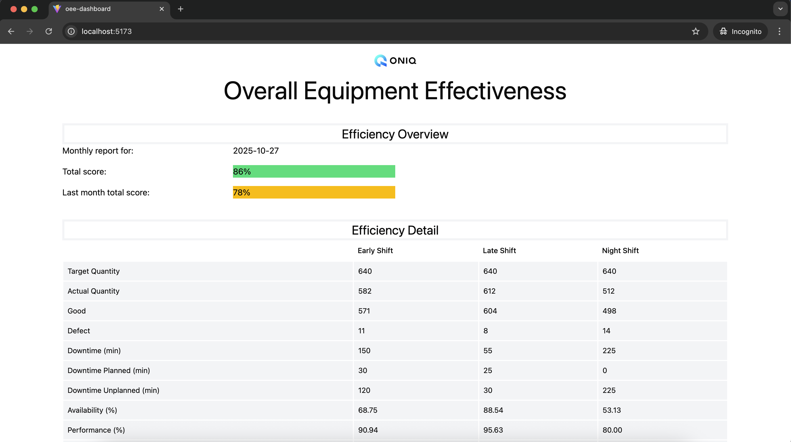
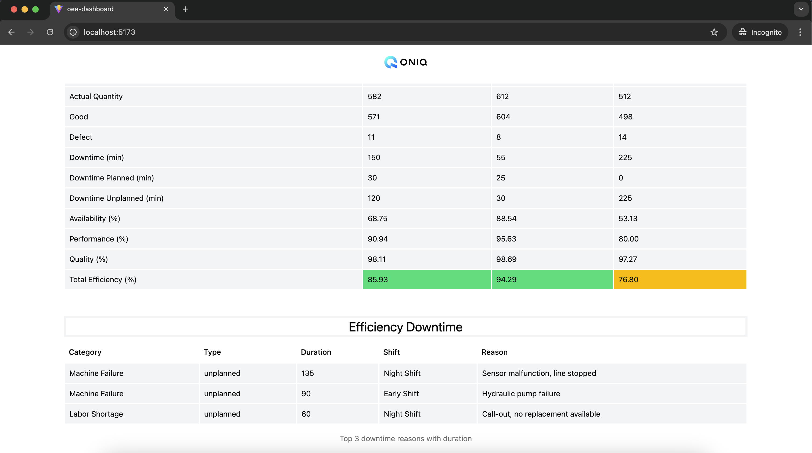

# ONIQ coding challenge

This SPA displays mocked data from a json file.

The app is designed to be accessible for Desktop and Mobile.

## Technology

- React
- Typescript
- Vite
- Shadcn ui for the design library

## Get started

`npm i` to install the dependencies

`npm run dev` to run the app locally

Open `http://localhost:5173/` to see the app locally

## Brief explanation of architecture decisions

The architecture of real applications must be designed to balance clarity, maintainability, and scalability. As this is a small private project I tried to keep things clear and easy to understand.

1. Separation of Concerns
   Logic and UI are separated when possible into distinct layers to make the codebase more modular and easier to update e.g. useCalculation.ts which gather the functions that calculate the percentages.

2. Reusability and Consistency
   Utility functions are centralized to reduce duplication and keeps the consistency across the application.

3. Scalability in Data Handling
   There is no need to fetch data in this project but scalability also involves typing the processed data.

4. Performance Awareness
   Functions that do calculation can make a webasite slow. It is best to memoize them. This draft of application has room for performance improvments e.g. momoization, replacements of filter() with forEach loops...

5. Readability Over Complexity
   I chose simplicity when possible, favoring maintainable code over overly abstract or premature optimization.

## Short Analysis (200-300 words)

Based on the data, the production line is facing three main issues:

- High unplanned downtime, particularly linked to Machine Failures and Labor Shortages.
- Downtime has a strong negative impact on overall availability, which in turn lowers total operational efficiency.
- The Night Shift shows lower Performance and Quality rates, suggesting possible workflow, staffing, or training challenges that should be investigated further.

Despite these concerns, the total monthly efficiency has improved compared to the previous month, indicting progress at a broader level.

## View of the app

I added some screenshots of the app in the `./src/assets/views` folder.

Desktop view:

